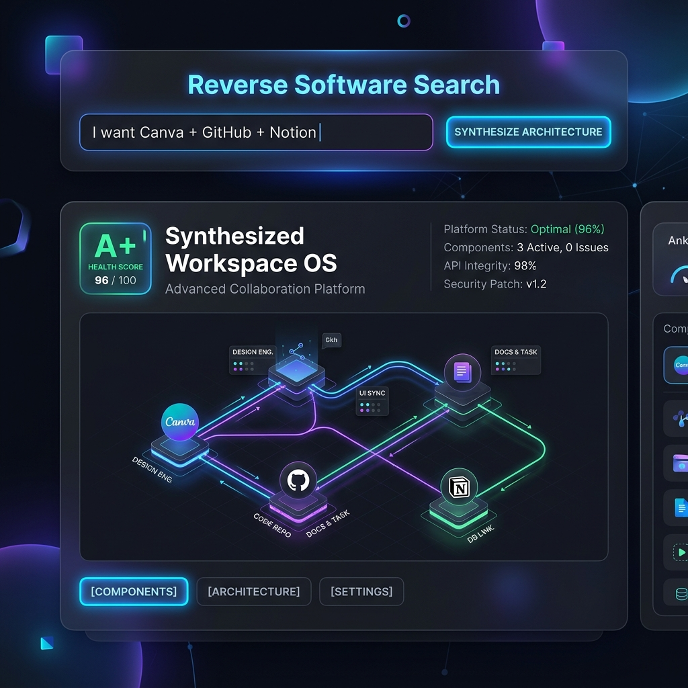
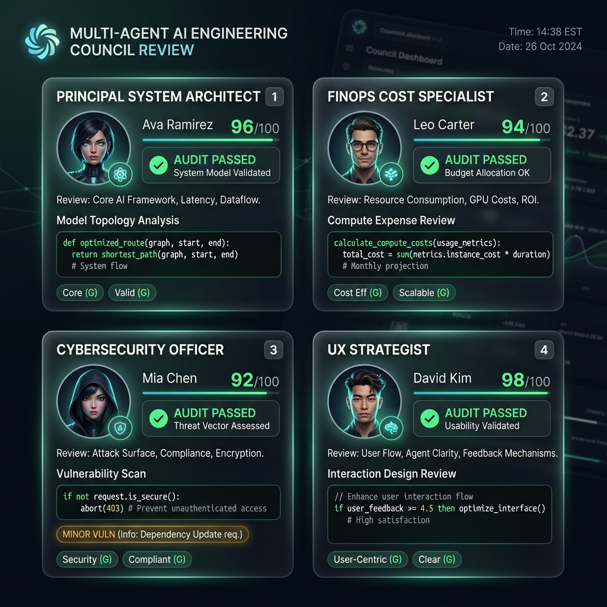
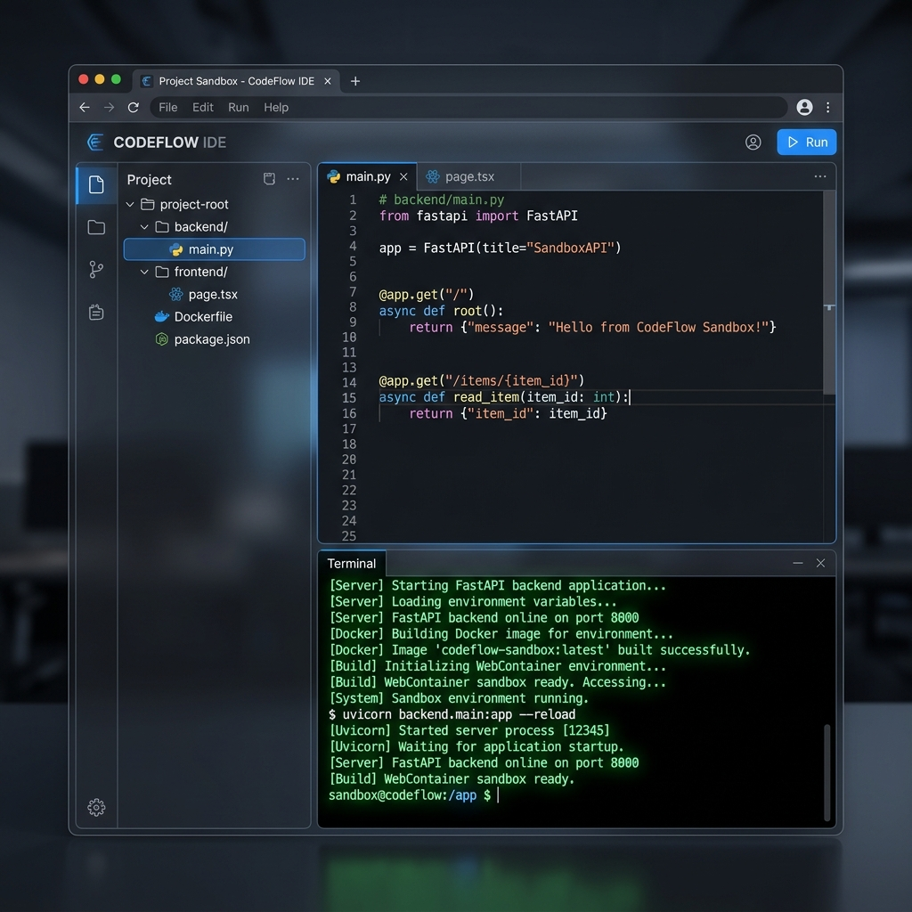

# 🔍 Reverse Software Search (RSS)

> **Translate natural language product concepts into complete engineering blueprints, capabilities graphs, multi-agent AI reviews, database designs, architecture diagrams, live sandbox execution previews, and download-ready starter repositories.**



Reverse Software Search (RSS) is a next-generation AI software synthesis platform. By entering natural language prompts (or picking pre-loaded creative concepts like *"ZeroCost AI SaaS Architect"* or *"I want Discord for hospitals"*), RSS reverse-engineers software genetics, synthesizes custom engineering specifications across 18 distinct design dimensions, runs a simulated Multi-Agent Engineering Council review, and outputs a complete, deployable boilerplate package ready for download and sandbox execution.

---

## 🎨 Visual Showcase & Previews

### 1. 🛡️ Multi-Agent Engineering Council Review Board

*Simulated AI Council featuring 4 specialized personas evaluating System Architecture, Cloud Costs, Cybersecurity, and UX Accessibility with automated code remediation snippets.*

### 2. ⚡ Live WebContainer Code Sandbox Execution

*Interactive browser-based sandbox displaying multi-file repository architecture, syntax-highlighted code editor, and live process output logs.*

---

## ✨ Features & Capabilities

RSS leverages a modular multi-engine pipeline to generate a comprehensive architectural blueprint:

1. **Software Genome Matching**: Maps your prompt against pre-seeded profiles of industry giants (**Notion**, **GitHub**, **Canva**, **Discord**, **Slack**, **VSCode**) to copy their structural patterns, tech stacks, and schemas.
2. **🛡️ Multi-Agent Engineering Council**: Evaluates every synthesized blueprint using 4 specialized AI personas (*Principal System Architect*, *FinOps Lead*, *Cybersecurity Officer*, and *UX Strategist*) with overall health scores, severity tags, and copyable code remediation snippets.
3. **⚡ Live WebContainer Sandbox Execution**: Run and test synthesized starter code files in a virtual Node.js/Python sandbox directly in your browser with interactive terminal execution logs.
4. **Dynamic Capability Graphs**: Uses `NetworkX` on the backend and `@xyflow/react` (React Flow) on the frontend to render interactive service meshes, data flows, and module dependencies.
5. **Database Designer**: Synthesizes custom entity-relationship attributes and outputs complete PostgreSQL/SQLite DDL schemas.
6. **API Specification Generator**: Generates clean, RESTful OpenAPI/Swagger endpoints and WebSocket routes.
7. **Interactive UI Layouts**: Maps client routes, core layouts, and custom UI elements.
8. **User Journey & Workflows**: Generates sequence diagrams and user interaction maps.
9. **Infrastructure & LLM Cost Calculator**: Estimates monthly AWS/GCP cloud hosting and LLM token costs.
10. **OSS Replacement Recommendations**: Recommends open-source, self-hosted alternatives to replace proprietary elements.
11. **Startup Generator**: Produces complete pricing tiers, Go-To-Market (GTM) strategies, SWOT analysis, and pitch deck structures.
12. **Codebase Repository Synthesizer**: Compiles and outputs complete Next.js, FastAPI, Docker, and environment files in real-time, packaged inside a downloadable `.zip` archive.

---

## 💡 Creative Project Templates

RSS comes with preset creative product prompts ready to synthesize:
* 🛡️ **ZeroCost AI SaaS Architect**: Self-hosted Datadog/Segment alternative with zero cloud overhead.
* 🌉 **Autonomous API Bridge Generator**: Converts legacy REST endpoints into type-safe GraphQL SDKs.
* ⚡ **Neural Architecture Simulator**: High-scale traffic simulator testing 100k requests/sec bottlenecks.
* 🧬 **AI Codebase Genome Scanner**: GitHub repo scanner that identifies security flaws and modernizes code.

---

## 🛠️ Technology Stack

### Backend
* **Core Framework**: [FastAPI](https://fastapi.tiangolo.com/) (Python 3.10+)
* **Database / ORM**: SQLite (development default) / PostgreSQL, managed via [SQLAlchemy](https://www.sqlalchemy.org/)
* **AI Orchestration**: [LiteLLM](https://github.com/BerriAI/litellm) for uniform API calls to OpenAI, Claude, and local LLMs
* **Graph Modeling**: [NetworkX](https://networkx.org/) for capability graph layouts and topological queries
* **Code Generation**: [Jinja2](https://jinja.palletsprojects.com/) template compilation

### Frontend
* **Core Framework**: [Next.js 16](https://nextjs.org/) (App Router), [React 19](https://react.dev/), [TypeScript](https://www.typescriptlang.org/)
* **Graph Visualization**: [@xyflow/react](https://reactflow.dev/) (React Flow) for custom, interactive node layouts
* **Styling**: TailwindCSS 4 (via `@tailwindcss/postcss`) and vanilla CSS variables
* **Animations**: [Framer Motion](https://www.framer.com/motion/) for premium micro-interactions and transitions
* **State Management**: [Zustand](https://github.com/pmndrs/zustand)
* **Icons**: [Lucide React](https://lucide.dev/)
* **Visual Effects**: [canvas-confetti](https://github.com/catdad/canvas-confetti) for success highlights

---

## 📂 Project Structure

```
Reverse Software Search/
├── backend/
│   ├── app/
│   │   ├── engines/               # The 18 software synthesis sub-engines
│   │   │   ├── ai_planner.py      # Plans AI prompt chains and model routing
│   │   │   ├── api_generator.py   # Generates OpenAPI REST & WebSockets specs
│   │   │   ├── architecture.py    # Service mesh and system design planner
│   │   │   ├── cost_analyzer.py   # Cloud infrastructure & token cost calculator
│   │   │   ├── db_designer.py     # Generates schemas, tables, and SQL DDLs
│   │   │   ├── deployment.py      # Builds Dockerfiles, Compose, and K8s manifests
│   │   │   ├── genome_matcher.py  # Computes software genome similarity matches
│   │   │   ├── innovation.py      # Analyzes product market gaps and innovation vectors
│   │   │   ├── intent.py          # Extracted product audience, constraints, scope
│   │   │   ├── multi_agent_review.py # Multi-Agent Engineering Council assessment
│   │   │   ├── oss.py             # Maps components to open-source alternatives
│   │   │   ├── repo_generator.py  # Generates boilerplate code structure
│   │   │   ├── startup.py         # Startup blueprints (SWOT, pricing, GTM)
│   │   │   └── synthesis_pipeline.py # Main pipeline orchestrating all engines
│   │   ├── models/                # SQLAlchemy database models
│   │   ├── services/              # Shared data and business utilities
│   │   │   ├── capability_graph.py# In-memory system capability list & NetworkX graph
│   │   │   ├── genome_data.py     # Pre-seeded software genome specifications
│   │   │   └── llm_service.py     # LiteLLM connection setup
│   │   ├── config.py              # Environment configuration & defaults
│   │   ├── database.py            # SQLite session connections
│   │   └── main.py                # FastAPI routes, endpoints, CORS rules, & zip exporter
│   ├── requirements.txt           # Python backend dependencies
│   └── rss.db                     # Local SQLite database storing history
│
├── docs/
│   └── images/                    # UI Visual previews & screenshots
│       ├── dashboard_preview.png  # Hero RSS dashboard UI
│       ├── multi_agent_council.png# Multi-Agent Council review board
│       └── code_sandbox.png       # Live WebContainer code sandbox UI
│
├── frontend/
│   ├── src/
│   │   ├── app/                   # Next.js app pages, styles, layout
│   │   │   ├── globals.css        # Main Tailwind configuration and custom styling
│   │   │   ├── layout.tsx         # Global page template
│   │   │   └── page.tsx           # Comprehensive RSS interactive UI dashboard
│   │   └── components/            # Custom UI elements
│   │       ├── ArchitectureGraph.tsx # React Flow capability canvas renderer
│   │       └── CodePreview.tsx    # Code editor & Live WebContainer Sandbox execution
│   ├── package.json               # Node.js dependencies
│   └── tsconfig.json              # TypeScript compilation setup
├── .gitignore                     # Git exclusion rules
├── composer.json                  # PHP/Composer author details
├── LICENSE                        # MIT License
└── README.md                      # Project documentation
```

---

## 🚀 Getting Started

### Prerequisites
* **Python 3.10+**
* **Node.js 18+**

---

### 1. Setting Up the Backend API

1. Navigate to the `backend` folder:
   ```bash
   cd backend
   ```

2. Create a virtual environment:
   ```bash
   # On macOS/Linux:
   python3 -m venv venv
   source venv/bin/activate

   # On Windows (PowerShell):
   python -m venv venv
   .\venv\Scripts\Activate.ps1
   ```

3. Install the dependencies:
   ```bash
   pip install -r requirements.txt
   ```

4. Configure environment variables (Optional):
   Create a `.env` file or export variables:
   ```env
   OPENAI_API_KEY=your-openai-api-key   # Optional if running in Mock Mode
   LITELLM_MODEL=gpt-4o-mini
   MOCK_LLM=True                        # Set to False to enable live LLM synthesis
   ```

5. Start the FastAPI development server:
   ```bash
   uvicorn app.main:app --reload --port 8000
   ```
   * **Swagger Docs**: Head to [http://localhost:8000/docs](http://localhost:8000/docs) to view and test backend endpoints.

---

### 2. Setting Up the Frontend Client

1. Navigate to the `frontend` folder:
   ```bash
   cd frontend
   ```

2. Install Node dependencies:
   ```bash
   npm install
   ```

3. Start the Next.js dev server:
   ```bash
   npm run dev
   ```

4. Access the web app:
   Open [http://localhost:3000](http://localhost:3000) in your web browser.

---

## 📄 License

This project is licensed under the [MIT License](LICENSE) - see the LICENSE file for details.

Developed by **Vijay Mahes** (`Vijaypradhap2004@gmail.com`).
